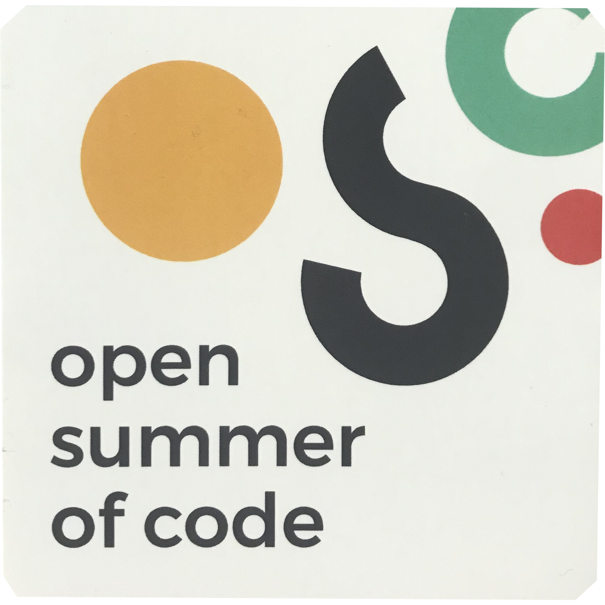
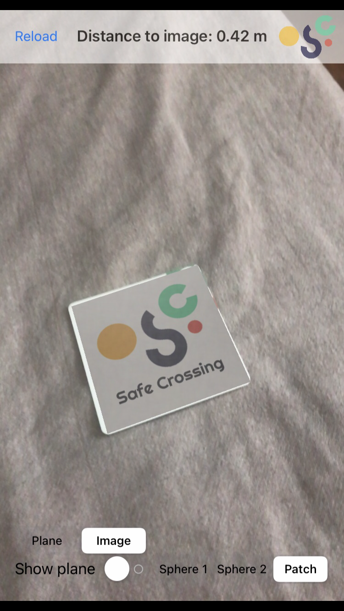
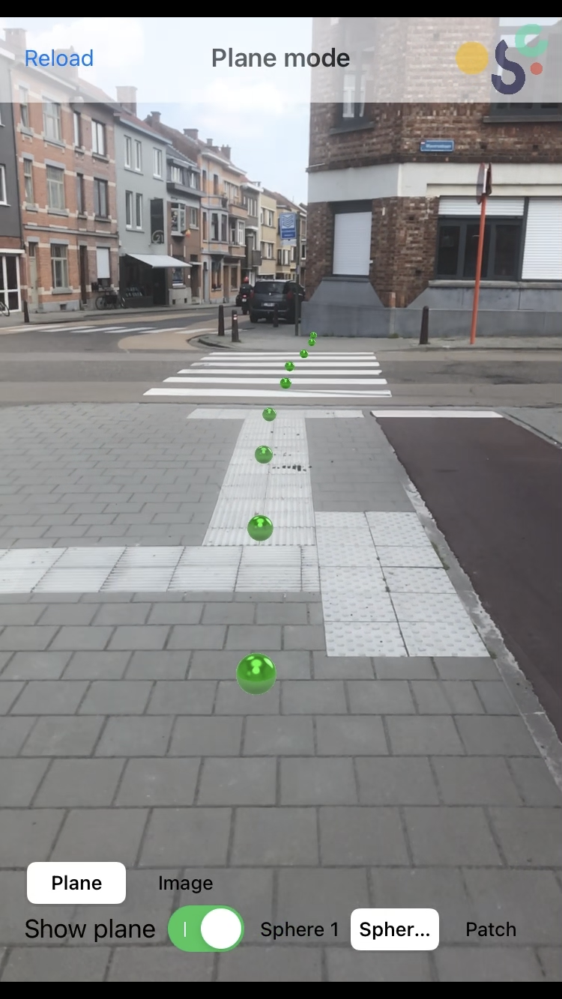
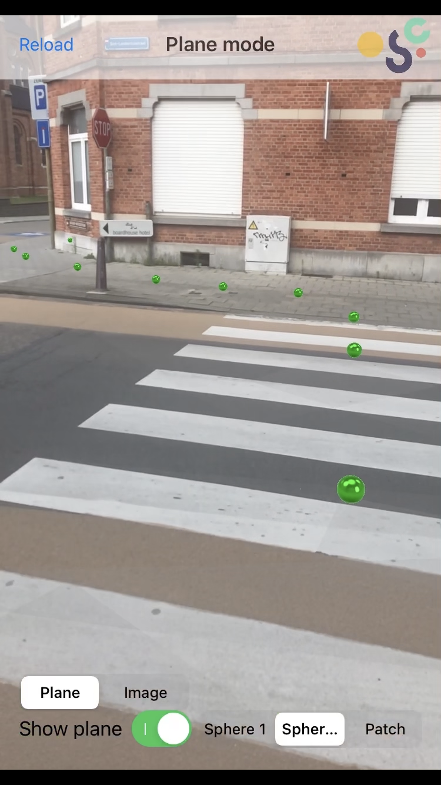

# ARKit #

This application was developed as a part of Safe Crossing project during the Open Summer of Code 2021. The main idea of this app is to show the proof of concept of possible Augmented Reality (AR) overlay for route marking.

## Modes: ##

#### 1. Image recognition ####
This mode allows the application to recognise and track provided input image. Because we can specify the size of the real-life image (10.5cm x 10.5cm), it is possible to measure the distance to the recognised image.
<p float="left">
  
</p>
The distance is computed between the camera position and the recognised image. Each object in the ARKit environment has a Transformation Matrix which specifies the scale, position, and translation of each object. We are primarily interested in the last column as it conveys the information about translation of the object. 

```
[r11 r12 r13 tx]

[r11 r12 r13 ty]

[r11 r12 r13 tz]

[  0   0   0  s]
```

So, subtracting crespective columns from each other and computing the Euclidean distance allows us to measure the distance to the recognised object as shown below:
<p float="left">
  
</p>

#### 2. Horizontal plane recognition ####
Another mode of application operation is based on plane detection. Plane detection in ARKit is based on simple feature points extraction. When the plane is detected, the app overlays a tappable transparent plane and offers a possibility of placing custom objects (two types of sphere and a patch).

<p float="left">
  
  
</p>

## App information: ##

The application was developed using Swift MVC paradigm and ARKit library. This combination was chosen due to the speed of development and efficient use of hardware.
