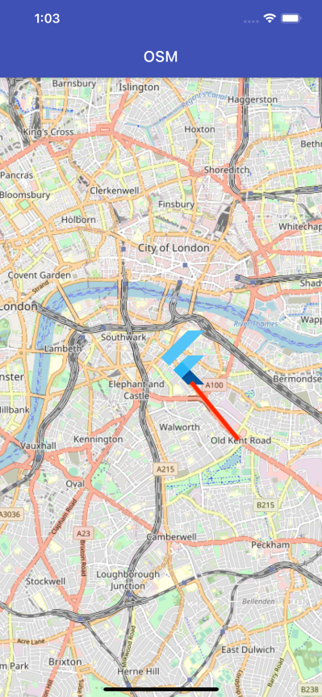
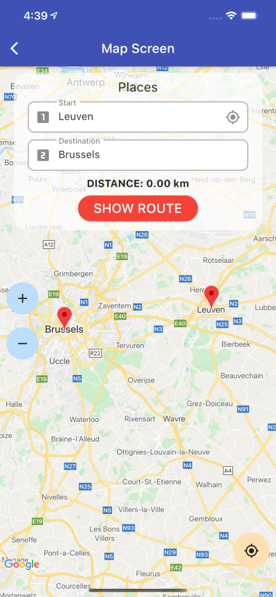
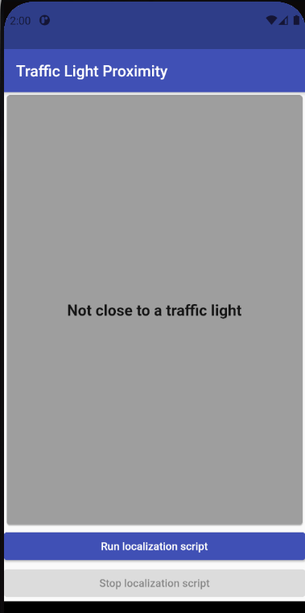

# Flutter routing and positioning application #

This application was developed as a part of Safe Crossing project during the Open Summer of Code 2021. The key idea for that application is to receive the data of both coarse and fine user locations to build route and accurately locate the user.

## Coarse positioning and route building using GPS data ##

The coarse positioning was tested on two platforms: OpenStreetMaps (OSM) and Google Maps (GCP):

#### OSM ####
The ```osm_screen.dart``` implements OSM functionality and path drawing using polylines. The entire route building pipeline was not developed as it was not the focus of the project, however it is possible to add a route building API. In this screen the route nodes were mocked and drawn on the map (red line).

<p float="left">
  
</p>

#### GCP ####

The ```map_screen.dart``` implements GCP functionality and path drawing using polylines. Additionally, a search by address was also integrated from [this tutorial](https://blog.codemagic.io/creating-a-route-calculator-using-google-maps/). Google Cloud Platform offers a wide range of out-of-the-box solutions such as address search, route building, position and orientation tracking. However, its main drawback is that it is no open source and after a certain limit user needs to pay for using the service.

<p float="left">
  
</p>

## Backend connection ##

<p float="left">
  
</p>

## App information: ##

The application was developed using Flutter, a cross-platform mobile development environment, to support both iOS and Android platform.
