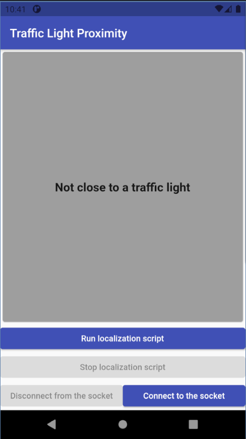

# Flutter routing and positioning application 

This application was developed as a part of Safe Crossing project during the Open Summer of Code 2021. The key idea for that application is to receive the data of both coarse and fine user locations to build route and accurately locate the user.

**The app has three screens but only the "Traffic Light Proximity" Screen is shown.**
If you want to activate other screens and define routes, refer to `main.dart` in `Frontend/lib` directory.

## Run the Code
Make sure you have [Flutter](https://flutter.dev/?gclsrc=ds&gclsrc=ds) installed.  
Make sure that you have either connected your phone to your device or you have an emulator running by running:  
```console
flutter devices
```

To run the application, change your directory to the `Frontend` directory and run:  
```console
flutter run
```

## Traffic Light Proximity Screen



This screen shows if the user is in the radius of a traffic light and if this is the case, it changes the color of the screen based on the status of that traffic light. If this isn't the case, the color of the screen is grey. This screen has a socket that connects to the socket of the backend. There is only one signal named `pozyx_data`. When this signal is received, we check the data and change the color of the screen accordingly. We use `socket_io_client` package for socket communications. The most important method in this file is the `handleData` method who is in charge of handling the received data (via the socket) from the backend. The `handleSocketConnection` method is for handling the socket signals while `connectSocket` and `disconnectSocket` are in charge of connecting and disconnecting the socket. `runLocalizationScript` is the method that sends a signal to the backend so the backend starts the localizing script. The ```stopLocalizationScript``` does the opposite. It send a signal to backend to stop the localizing script.

## Coarse positioning and route building using GPS data 

The coarse positioning was tested on two platforms: OpenStreetMaps (OSM) and Google Maps (GCP):

**OSM** 
The ```osm_screen.dart``` implements OSM functionality and path drawing using polylines. The entire route building pipeline was not developed as it was not the focus of the project, however it is possible to add a route building API. In this screen the route nodes were mocked and drawn on the map (red line).

<p float="left">
  
</p>

**GCP** 

The ```map_screen.dart``` implements GCP functionality and path drawing using polylines. Additionally, a search by address was also integrated from [this tutorial](https://blog.codemagic.io/creating-a-route-calculator-using-google-maps/). Google Cloud Platform offers a wide range of out-of-the-box solutions such as address search, route building, position and orientation tracking. However, its main drawback is that it is no open source and after a certain limit user needs to pay for using the service.

<p float="left">
  
</p>

## App information: ##

The application was developed using [Flutter](https://flutter.dev/?gclsrc=ds&gclsrc=ds), a cross-platform mobile development environment, to support both iOS and Android platform.
